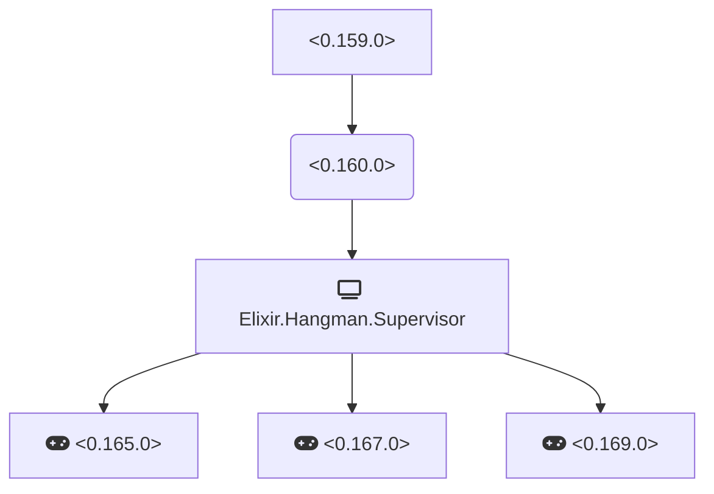

# CHANGELOG

## 2.0.0 2020-03-??
* Modify Hangman API:
  * `new_game`: now it start the internal server and returns `{:ok, game_pid}``
  * `tally` and `make_move`: it accepts now a game_pid as a parameter instead of a game instance.
* Add a GenServer implementation.
A typical game session in the iex console now its like this:
```elixir
iex(1)> {:ok, pid} = Hangman.new_game()
{:ok, #PID<0.162.0>}

iex(2)> Hangman.tally(pid)
%{
  game_state: :initializing,
  letters: ["_", "_", "_", "_", "_", "_", "_"],
  turns_left: 7,
  used_letters: []
}

iex(3)> Hangman.make_move(pid, "a")
%{
  game_state: :good_guess,
  letters: ["_", "_", "_", "_", "a", "_", "_"],
  turns_left: 7, 
  used_letters: ["a"]
}

iex(4)> Hangman.make_move(pid, "p")
%{
  game_state: :bad_guess,
  letters: ["_", "_", "_", "_", "a", "_", "_"],
  turns_left: 6,
  used_letters: ["a", "p"]
}

iex(5)> Hangman.make_move(pid, "p")
%{
  game_state: :already_used,
  letters: ["_", "_", "_", "_", "a", "_", "_"],
  turns_left: 6,
  used_letters: ["a", "p"]
}
```
* Add an application implementation with a dynamic supervisor so 
we can spawn games with supervisor. Example:
```elixir
iex(1)> Supervisor.start_child(Hangman.Supervisor, [])
{:ok, #PID<0.165.0>}

iex(2)> {:ok, game1} = Supervisor.start_child(Hangman.Supervisor, [])
{:ok, #PID<0.167.0>}

iex(3)> {:ok, game2} = Supervisor.start_child(Hangman.Supervisor, [])
{:ok, #PID<0.169.0>}
        
iex(4)> Hangman.tally(game1)
%{
  game_state: :initializing,
  letters: ["_", "_", "_", "_", "_", "_"],
  turns_left: 7,
  used_letters: []
}

iex(5)> Hangman.tally(game2)
%{
  game_state: :initializing,
  letters: ["_", "_", "_", "_", "_", "_", "_", "_", "_"],
  turns_left: 7,
  used_letters: []
}

iex(6)> Hangman.make_move(game2, "a")
%{
  game_state: :good_guess,
  letters: ["_", "_", "_", "_", "_", "a", "_", "_", "_"],
  turns_left: 7,
  used_letters: ["a"]
}

iex(7)> Hangman.make_move(game1, "e")
%{
  game_state: :good_guess,
  letters: ["_", "_", "_", "_", "_", "e"],
  turns_left: 7,
  used_letters: ["e"]
}
```
This will lead to a tree like this:


## 1.1.0 2019-12-24
* Game struct has now the used letters

## 1.0.0 2019-11-11
* The base hangman game engine
